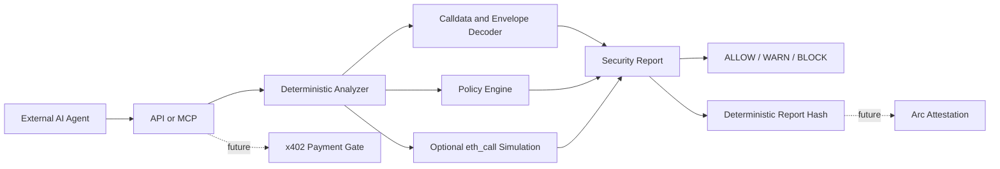

# AgentWarden

[](https://github.com/Neeraj1850/agent-warden/actions/workflows/ci.yml)
[](LICENSE)
[](package.json)

AgentWarden is an AI-agent transaction security layer for blockchain agents. It analyzes unsigned EVM transactions before an agent signs or broadcasts them, with MCP and x402 integrations layered on top after the deterministic analyzer is solid.

AI agents are increasingly able to construct and submit onchain transactions, but most signing flows still trust generated calldata too early. AgentWarden sits between agent intent and wallet signing, decodes the unsigned EVM transaction, checks it against policy, and returns a deterministic security report that another agent, wallet, or human can inspect before funds or permissions move.

AgentWarden is for:

- AI agent builders that need a pre-sign transaction firewall
- wallets and smart account systems that need independent intent checks
- security reviewers evaluating agent transaction pipelines
- grant reviewers looking for a concrete MCP-native security primitive

The MVP is intentionally deterministic. It receives structured intent plus unsigned transaction data, decodes common ERC-20 calldata, applies policy checks, and returns a signed-analysis style report:

- `ALLOW`, `WARN`, or `BLOCK`
- deterministic risk score
- multi-dimensional risk vector
- decoded transaction
- policy violations
- human-readable summary, findings, and recommended action
- simulation result placeholder
- safer alternative
- report hash for future onchain attestation

LLMs may explain results later, but the deterministic policy engine is always the final authority.

## Architecture



## Transaction Analysis V1

AgentWarden now focuses first on pre-sign EVM transaction analysis. The analyzer classifies transaction envelopes, decodes agent-common actions, checks intent alignment, finds risky approvals, computes static asset deltas, and can optionally run `eth_call` simulation when `ANALYSIS_RPC_URL` is configured.

V1 coverage:

- native transfers and contract deployments
- ERC-20 transfers, `transferFrom`, and approvals
- ERC-721 transfers, token approvals, and `setApprovalForAll`
- ERC-1155 transfers, batch transfers, and `setApprovalForAll`
- common swap and multicall selectors
- EIP-7702 authorization-list detection

x402 remains parked and disabled by default while the analyzer core matures.

## How The Flow Works

1. An agent prepares an unsigned EVM transaction and structured intent.
2. The agent calls AgentWarden through the API or MCP tool.
3. AgentWarden decodes calldata and validates the request.
4. The policy engine checks chain, sender, token, recipient or spender, amount, unknown selectors, and unlimited approvals.
5. The analyzer returns a deterministic verdict and report hash.
6. Future versions will require x402 payment before analysis and anchor report hashes on Arc Testnet.

## Local Development

This repository uses pnpm workspaces.

```bash
pnpm install
pnpm test
pnpm lint
pnpm dev
```

The current MVP does not require paid APIs or external services.

Machine-readable API contract: [`docs/openapi.yaml`](docs/openapi.yaml).

Release notes are tracked with Changesets metadata in [`.changeset`](.changeset).

Optional enrichments are disabled by default:

- `GROQ_API_KEY` + `GROQ_MODEL` enable the LangChain/Groq report explainer.
- `TENDERLY_RPC_URL` enables Tenderly simulation instead of raw `eth_call`.
- `GOPLUS_ENABLED=true` enables GoPlus address checks for MCP `check_address`.
- `ANALYSIS_RPC_URL` can be used by whatsabi helpers for dynamic ABI recovery.

## Mock Agent Flow

The mock agent simulates an AI agent with a wallet address preparing an unsigned Ethereum Sepolia transaction.

Start AgentWarden with mock x402 enabled:

```bash
X402_ENABLED=true X402_MODE=mock pnpm --filter @agent-warden/api dev
```

Run a safe transfer request:

```bash
pnpm --filter @agent-warden/mock-agent safe
```

Run a malicious unlimited approval request:

```bash
pnpm --filter @agent-warden/mock-agent malicious
```

This uses Ethereum Sepolia for the transaction being analyzed and a local mock x402 payment header for the API gate. Real public x402 testnet payments should use Base Sepolia `eip155:84532`.

## Attack Payload Suite

Run the analyzer demo suite locally without the API:

```bash
pnpm --filter @agent-warden/attack-payloads local
```

Run the same suite against `POST /analyze`:

```bash
$env:X402_ENABLED="false"
pnpm --filter @agent-warden/api dev
pnpm --filter @agent-warden/attack-payloads api
```

The suite covers safe transfers, unlimited approvals, NFT operator approvals, suspicious multicalls, EIP-7702 authorization lists, hidden native value, unknown selectors, deployments, and swap selectors.

It also includes permit-style approvals and EIP-4337 account abstraction bundles as bypass regression cases.

Each run writes reviewer-friendly artifacts:

- `examples/attack-payloads/results/demo-report.md`
- `examples/attack-payloads/results/demo-report.json`

Use `--no-artifacts` if you only want console output.

## MCP Tool

The MCP server package exposes an `analyze_transaction` tool wrapper around the core analyzer over the official MCP TypeScript SDK stdio transport.

Run the server:

```bash
pnpm --filter @agent-warden/mcp-server dev
```

Run the local MCP client demo:

```bash
pnpm --filter @agent-warden/mcp-server demo
```

The demo client spawns the stdio server, lists tools, sends a safe ERC-20 transfer and a malicious unlimited approval, and prints the returned summary, recommended action, verdict, risk score, and report hash.

## x402 Integration Plan

The API now supports an x402-protected `/analyze` path through Express middleware.

Local mock mode:

```bash
X402_ENABLED=true X402_MODE=mock pnpm --filter @agent-warden/api dev
```

Real Base Sepolia mode:

```bash
X402_ENABLED=true \
X402_MODE=real \
X402_PAY_TO=0xYourReceivingWallet \
X402_PRICE=$0.001 \
X402_NETWORK=eip155:84532 \
pnpm --filter @agent-warden/api dev
```

The first grant demo should:

- protect analysis requests with x402
- require a max payment cap
- bind payment metadata to the analysis request hash
- reject replayed or mismatched payments
- keep paid endpoint responses untrusted

## Arc Integration Plan

The `packages/arc` package and `contracts` folder contain placeholders for:

- Arc Testnet client setup
- report hash anchoring
- ERC-8004 agent identity
- ERC-8183 security-review jobs
- policy registry governance

Arc is the target settlement and attestation environment for the grant-facing roadmap.
