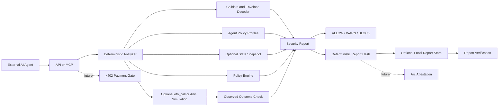

# AgentWarden

[](https://github.com/Neeraj1850/agent-warden/actions/workflows/ci.yml)
[](LICENSE)
[](package.json)

AgentWarden is an AI-agent transaction security layer for blockchain agents. It analyzes unsigned EVM transactions before an agent signs or broadcasts them, with MCP and x402 integrations layered on top after the deterministic analyzer is solid.

AI agents are increasingly able to construct and submit onchain transactions, but most signing flows still trust generated calldata too early. AgentWarden sits between agent intent and wallet signing, decodes the unsigned EVM transaction, checks it against policy, and returns a deterministic security report that another agent, wallet, or human can inspect before funds or permissions move.

AgentWarden is for:

- AI agent builders that need a pre-sign transaction firewall
- wallets and smart account systems that need independent intent checks
- security reviewers evaluating agent transaction pipelines
- teams building MCP-native agent security workflows

The MVP is intentionally deterministic. It receives structured intent plus unsigned transaction data, decodes common ERC-20 calldata, applies policy checks, and returns a signed-analysis style report:

- `ALLOW`, `WARN`, or `BLOCK`
- deterministic risk score
- multi-dimensional risk vector
- decoded transaction
- policy violations
- human-readable summary, findings, and recommended action
- simulation result placeholder
- safer alternative
- report hash for future onchain attestation

LLMs may explain results later, but the deterministic policy engine is always the final authority.

## Architecture



## Transaction Analysis V1

AgentWarden now focuses first on pre-sign EVM transaction analysis. The analyzer classifies transaction envelopes, decodes agent-common actions, checks intent alignment, finds risky approvals, computes static asset deltas, and can optionally run `eth_call` simulation when `ANALYSIS_RPC_URL` is configured.

V1 coverage:

- native transfers and contract deployments
- ERC-20 transfers, `transferFrom`, and approvals
- ERC-721 transfers, token approvals, and `setApprovalForAll`
- ERC-1155 transfers, batch transfers, and `setApprovalForAll`
- common swap and multicall selectors
- EIP-7702 authorization-list detection

x402 remains parked and disabled by default while the analyzer core matures.

## How The Flow Works

1. An agent prepares an unsigned EVM transaction and structured intent.
2. The agent calls AgentWarden through the API or MCP tool.
3. AgentWarden decodes calldata and validates the request.
4. The policy engine checks chain, sender, token, recipient or spender, amount, unknown selectors, and unlimited approvals.
5. The analyzer returns a deterministic verdict and report hash.
6. If `REPORT_STORE_DIR` is configured, the completed report is persisted as `<reportHash>.json`.
7. The report can be retrieved and verified deterministically before any future anchoring flow.

## Local Development

This repository uses pnpm workspaces.

```bash
pnpm install
pnpm test
pnpm demo:mvp
pnpm lint
pnpm dev
```

The current MVP does not require paid APIs or external services.

### Run MVP Demo

The fastest local proof is:

```bash
pnpm demo:mvp
```

It runs deterministic offline scenarios for:

- allowlisted payment transfer
- blocked non-allowlisted payment recipient
- blocked treasury approval
- allowed trading router swap with mocked simulation
- blocked unknown trading router
- local report persistence and verification for one allowed and one blocked report

Expected output shape:

```text
[mvp-demo] AgentWarden deterministic MVP flow
[PASS] payment-allowlisted-transfer expected=ALLOW actual=ALLOW risk=5 action=erc20_transfer
       violations=none
       recommendedAction=...
       hash=0x...
[mvp-demo] reportStore=C:\Users\...\agent-warden-mvp-...
[mvp-demo] verify allow=true block=true
[mvp-demo] complete total=5 failures=0
```

Machine-readable API contract: [`docs/openapi.yaml`](docs/openapi.yaml).

Release notes are tracked with Changesets metadata in [`.changeset`](.changeset).

Optional enrichments are disabled by default:

- `GROQ_API_KEY` + `GROQ_MODEL` enable the LangChain/Groq report explainer.
- `REPORT_STORE_DIR` enables local JSON report persistence and `GET /reports/:hash`.
- `TENDERLY_RPC_URL` enables Tenderly simulation instead of raw `eth_call`.
- `GOPLUS_ENABLED=true` enables GoPlus address checks for MCP `check_address`.
- `ANALYSIS_RPC_URL` can be used by whatsabi helpers for dynamic ABI recovery.

## Mock Agent Flow

The mock agent simulates an AI agent with a wallet address preparing an unsigned Ethereum Sepolia transaction.

Start AgentWarden with deterministic mock x402 enabled:

```bash
X402_ENABLED=true X402_PROVIDER=mock X402_PAY_TO=0xYourReceivingWallet pnpm --filter @agent-warden/api dev
```

Run a safe transfer request:

```bash
pnpm --filter @agent-warden/mock-agent safe
```

Run a malicious unlimited approval request:

```bash
pnpm --filter @agent-warden/mock-agent malicious
```

This uses Ethereum Sepolia for the transaction being analyzed and a local mock payment retry. The same challenge and canonical request hash are used for preflight and delivery.

## Local Arc Fork Flow

The Arc fork demo proves the full analyzer path without wallets, faucets, Gateway deposits, or real payments:

```bash
pnpm demo:arc-fork
```

It starts an external Anvil process forked from Arc Testnet, verifies chain ID `5042002`, seeds a deterministic fixture wallet with fork-only native USDC, and runs:

- a mock-x402 native Arc USDC payment that must return `ALLOW`
- an unlimited Arc USDC approval that must return `BLOCK`
- Ethers live state reads against the fork
- Anvil execution with snapshot rollback

The default fixture addresses are intentionally deterministic and local-only. No private key or faucet balance is used. Arc exposes native USDC with 18-decimal gas precision and a shared 6-decimal ERC-20 interface; the fixture verifies both views after seeding.

The safe scenario uses native value because Anvil does not reproduce Arc's custom native-USDC ERC-20 `transfer` extension. Allowance calls such as `approve` remain executable on the fork, so the malicious approval scenario still exercises the ERC-20 security path.

To manage Anvil separately:

```bash
anvil --fork-url https://rpc.testnet.arc.network --chain-id 5042002 --port 8545
pnpm arc:fork:seed
```

Then start the API with `ANALYSIS_RPC_URL` and `ANVIL_RPC_URL` set to `http://127.0.0.1:8545`, and run:

```bash
pnpm --filter @agent-warden/mock-agent arc:safe
pnpm --filter @agent-warden/mock-agent arc:malicious
```

## Attack Payload Suite

Run the analyzer demo suite locally without the API:

```bash
pnpm --filter @agent-warden/attack-payloads local
```

Run the same suite against `POST /analyze`:

```bash
$env:X402_ENABLED="false"
pnpm --filter @agent-warden/api dev
pnpm --filter @agent-warden/attack-payloads api
```

The suite covers safe transfers, unlimited approvals, NFT operator approvals, suspicious multicalls, EIP-7702 authorization lists, hidden native value, unknown selectors, deployments, and swap selectors.

It also includes permit-style approvals and EIP-4337 account abstraction bundles as bypass regression cases.

Each run writes reproducible analysis artifacts:

- `examples/attack-payloads/results/demo-report.md`
- `examples/attack-payloads/results/demo-report.json`

Use `--no-artifacts` if you only want console output.

## MCP Tool

The MCP server exposes transaction and signature analysis over the official MCP TypeScript SDK stdio transport. `MCP_ANALYSIS_MODE=local` calls the deterministic analyzer directly. `MCP_ANALYSIS_MODE=paid-api` uses the Arc Gateway-protected HTTP API and never silently falls back.

Run the server:

```bash
pnpm --filter @agent-warden/mcp-server dev
```

Run the local MCP client demo:

```bash
pnpm --filter @agent-warden/mcp-server demo
```

The demo client spawns the stdio server, lists tools, sends a safe ERC-20
transfer and a malicious unlimited approval, verifies the safe report through
`verify_report`, and prints the returned summary, recommended action, verdict,
risk score, and report hash. The MCP server also exposes `get_report` when
`REPORT_STORE_DIR` is configured.

## Arc Gateway x402

The API protects `POST /analyze` and `POST /analyze-signature`. Arc Testnet Circle Gateway Nanopayments is the primary testnet provider; the standard x402 EVM provider remains available for interoperability.

Local mock mode:

```bash
X402_ENABLED=true X402_PROVIDER=mock X402_PAY_TO=0xYourReceivingWallet pnpm --filter @agent-warden/api dev
```

Arc Gateway seller:

```bash
X402_ENABLED=true \
X402_PROVIDER=arc-gateway \
X402_PAY_TO=0xYourReceivingWallet \
X402_PRICE=$0.001 \
X402_ACCEPTED_NETWORKS=eip155:5042002 \
X402_GATEWAY_FACILITATOR_URL=https://gateway-api-testnet.circle.com \
pnpm --filter @agent-warden/api dev
```

Paid MCP bridge:

```bash
MCP_ANALYSIS_MODE=paid-api \
AGENTWARDEN_API_URL=http://localhost:8787 \
X402_PAYER_PRIVATE_KEY=0xTestnetOnlyKey \
X402_PAYER_CHAIN=arcTestnet \
X402_PAY_TO=0xYourReceivingWallet \
X402_MAX_PRICE=$0.01 \
pnpm --filter @agent-warden/mcp-server dev
```

Before signing, MCP performs an unpaid preflight and validates the price, Arc network, USDC asset, seller, exact scheme, and Gateway verifying contract from Circle `CHAIN_CONFIGS`. Payment is bound to a random challenge plus the canonical route/body hash. Replays, substitutions, expiry, and concurrent challenge reuse are rejected.

`X402_PROVIDER=standard` retains the standard facilitator-based x402 seller path. The legacy `X402_MODE=mock|real` setting maps to `mock|standard` only when `X402_PROVIDER` is absent.

## Arc Integration Plan

Arc Gateway payments are integrated now. The `packages/arc` package and `contracts` folder remain separate boundaries for:

- Arc Testnet client setup
- report hash anchoring
- ERC-8004 agent identity
- ERC-8183 security-review jobs
- policy registry governance

ERC-8004 identity, ERC-8183 escrowed review jobs, Circle managed wallets, account abstraction, and report anchoring are deliberately outside this payment milestone. They do not strengthen request-payment binding, and Gateway V1 requires an EOA signer rather than EIP-1271 contract signatures.
