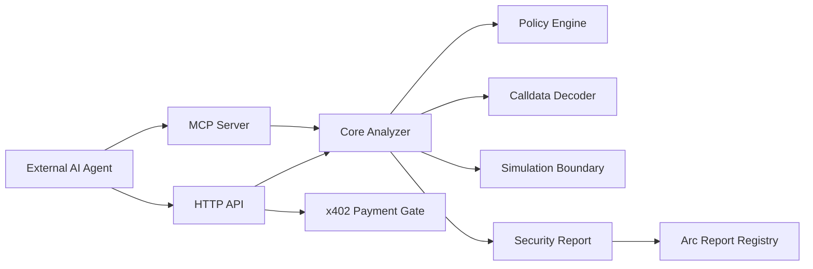

# Architecture

ArcWarden is split into deterministic analysis, transport wrappers, payment verification, and future onchain attestation.

The first MVP keeps the analyzer local and deterministic. Network integrations are represented by explicit interfaces so each can be added without changing core policy behavior.
